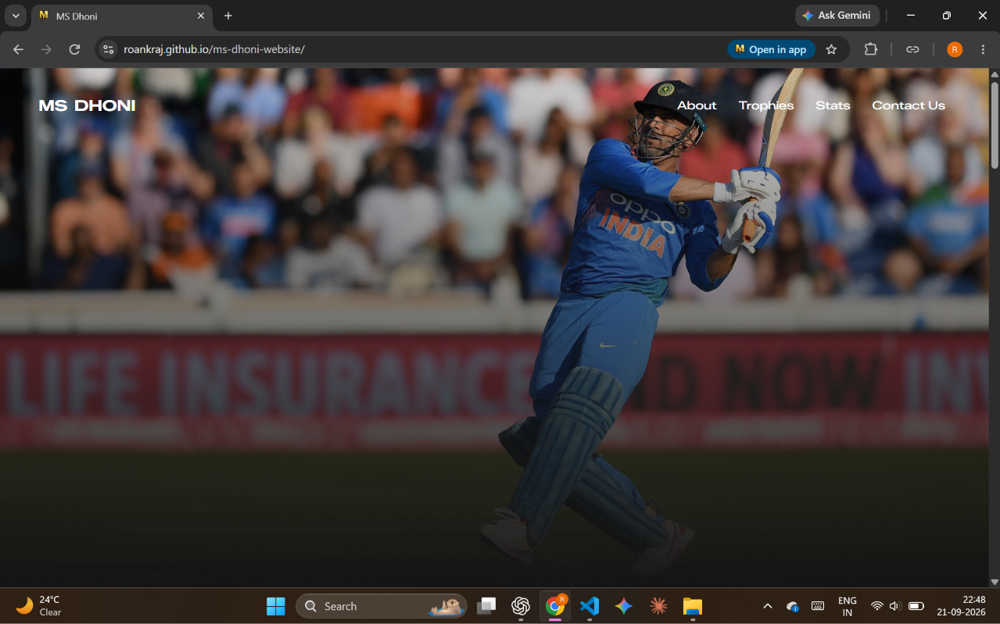
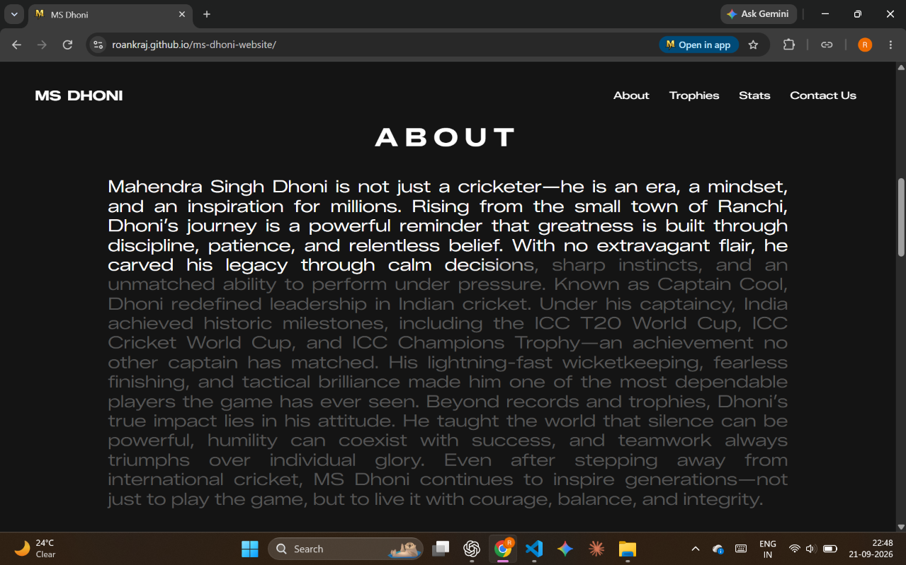
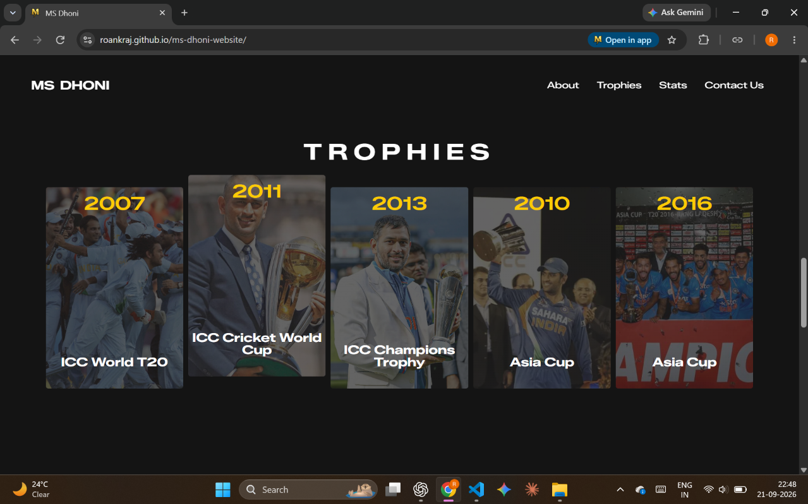
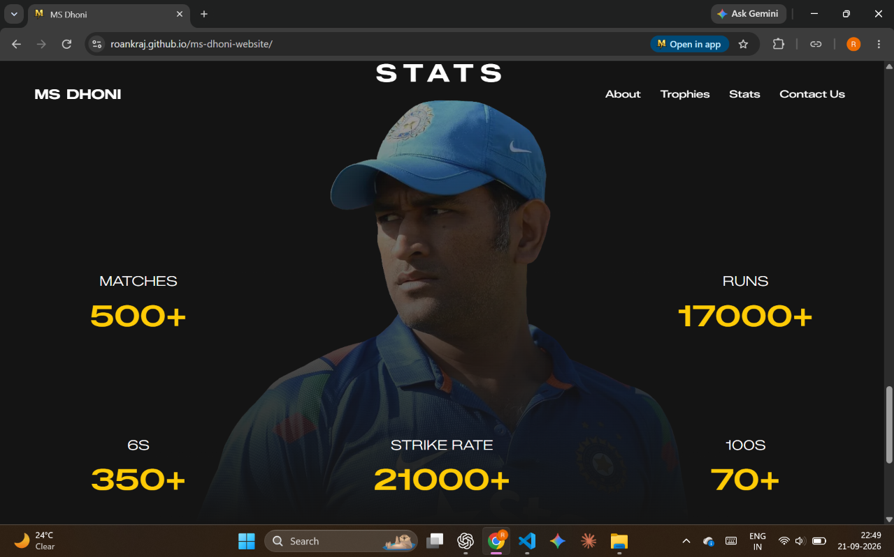

# MS Dhoni Website 🏏

A tribute website for MS Dhoni, built as part of my web development learning journey.

🔗 **Live Demo:** [roankraj.github.io/ms-dhoni-website](https://roankraj.github.io/ms-dhoni-website/)

## 📖 About

This project showcases MS Dhoni's cricketing legacy, including his career highlights, trophies, and statistics, through a clean, responsive single-page design.

## 📸 Screenshots

<div align="center">
  <div style="display: flex; justify-content: center; gap: 20px; margin-bottom: 20px;">
    
    
  </div>

  <div style="display: flex; justify-content: center; gap: 20px;">
    
    
  </div>
</div>

## ✨ Features

- **About Section** – A brief overview of MS Dhoni's career and impact
- **Trophies Gallery** – Major tournament wins (ICC World T20, Cricket World Cup, Champions Trophy, Asia Cup)
- **Stats Overview** – Key career statistics (matches, runs, centuries, strike rate, sixes)
- **Responsive Navigation** – Smooth scrolling navigation bar
- **Social Links** – Footer with social media icons

## 🛠️ Built With

- **HTML5** – Page structure and content
- **CSS3** – Styling and responsive layout

## 🚀 Getting Started

1. Clone the repository
   ```bash
   git clone https://github.com/roankraj/ms-dhoni-website.git
   ```
2. Open `index.html` in your browser

## 📂 Project Structure

```
ms-dhoni-website/
├── index.html
├── styles.css
├── queries.css
├── script.js
└── img/
    └── favicon.ico
```

## 📌 Purpose

This project was developed using HTML and CSS as part of my learning journey in web development.
